# Creating a Custom IP for PS-PL data exchange in Vivado

In this tutorial you'll learn how to exchange information between the PS and PL, effectively allowing to read and write to the default USART from the PL.

## The results

In this example the USART data will be sent to the PL, and then the PL will send back the same data to the PL to be print in the terminal, and also (if it's a number) it will light their corresponding binary value using the on-board LEDs.

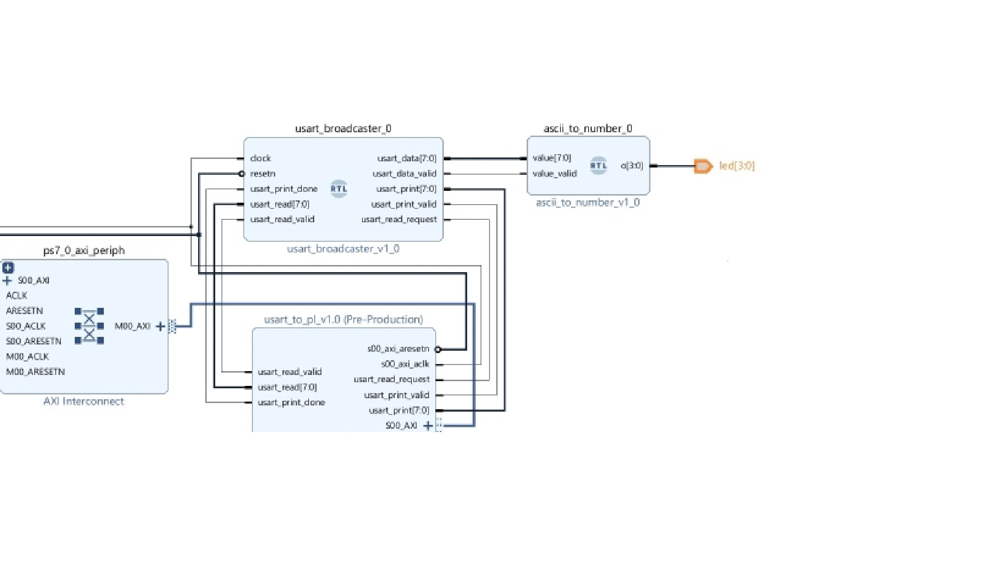

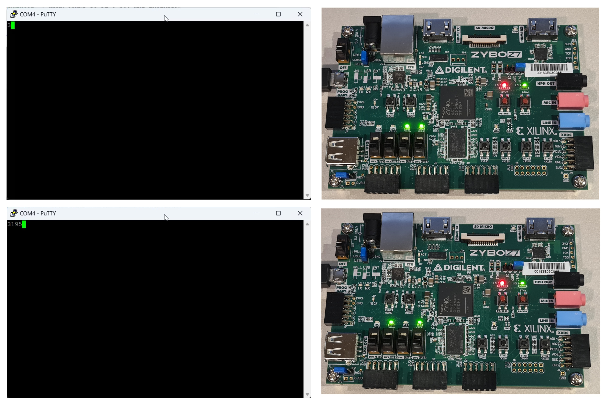

## Requirements

- Vivado & Vitis 2023.1 (you can check how to install them [here](https://digilent.com/reference/programmable-logic/guides/installing-vivado-and-vitis))
- A ZYBO Z7-10, or 20
- Your board XDC file (you should be able to find it [here](https://github.com/Digilent/digilent-xdc/archive/master.zip))

## Steps

### Creating a new Vivado project

1. Create a new Vivado project

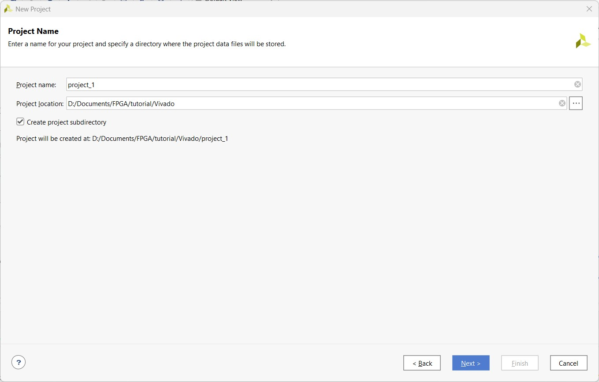

Select "RTL Project" as the Project Type.

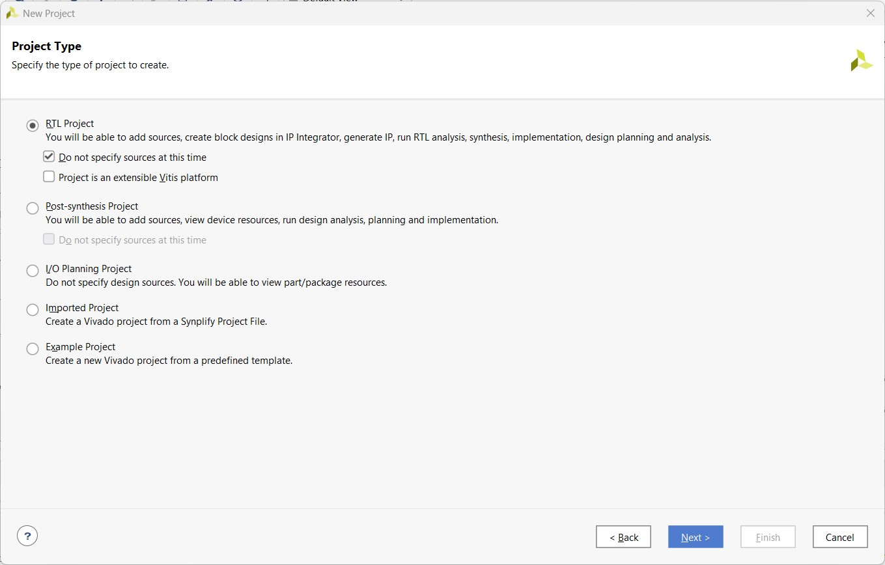

2. Under the "Boards" section, select your board. If you don't have it installed, hit the "download" button next to it

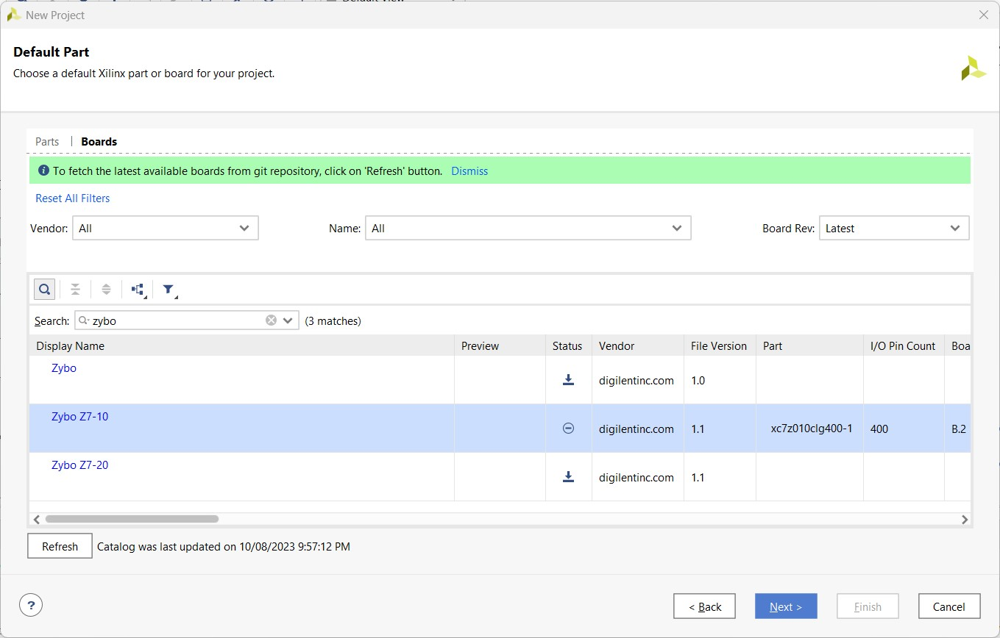

3. Select "Finish"

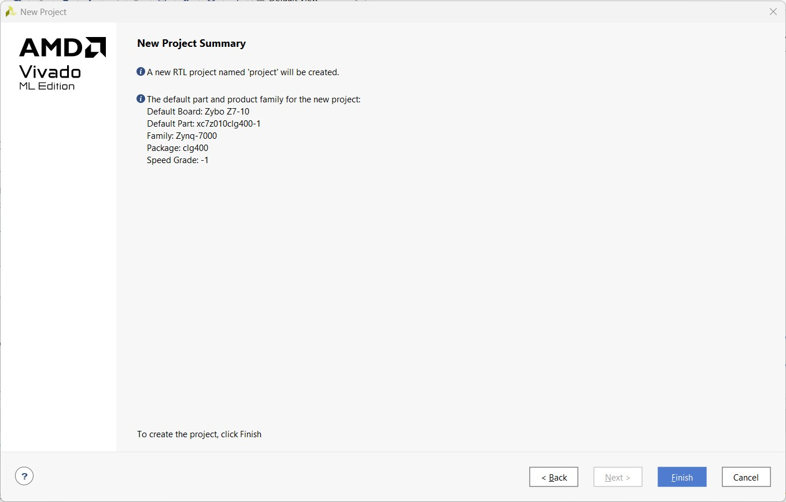

4. As this tutorial will use VHDL as language, enter the Settings menu (top left, the cogwheel icon), and switch "Target language" to VHDL. Then hit "Apply", and "OK"

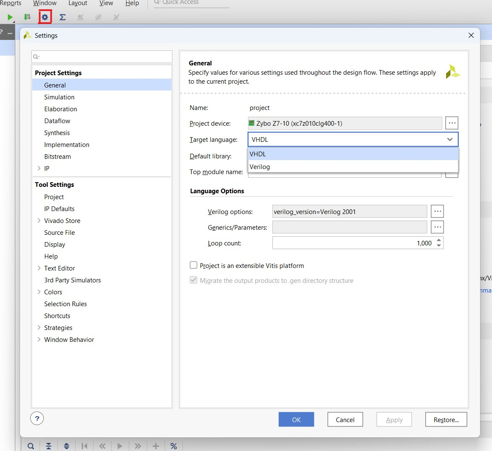

### Creating a custom AXI IP

To interact with the AXI interface we'll need a custom IP.

1. Under "Tools", click "Create and Package New IP..."

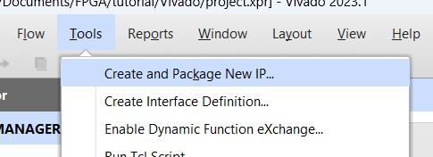

2. Hit "Next", select "Create a new AXI4 peripheral", then "Next"

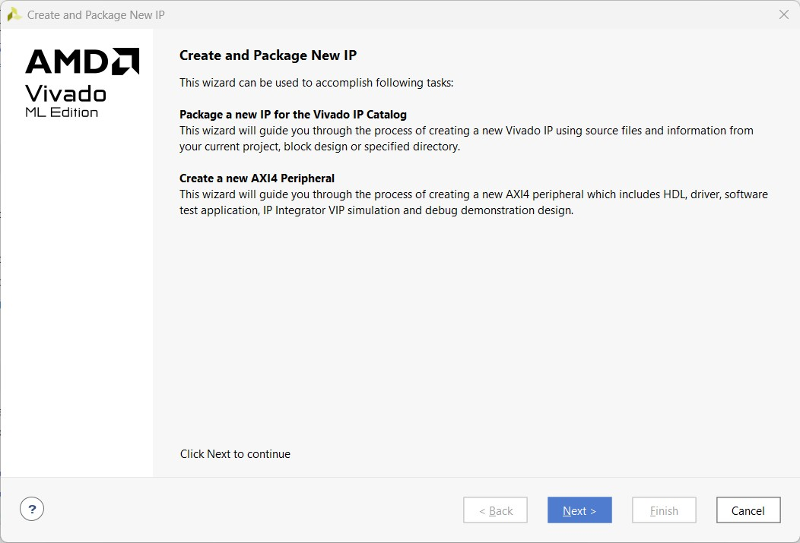

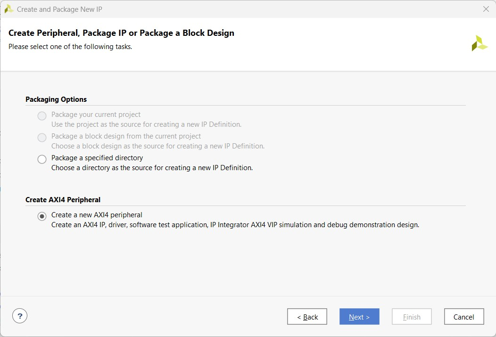

3. Set the IP name `usart_to_pl`. You can also set a description

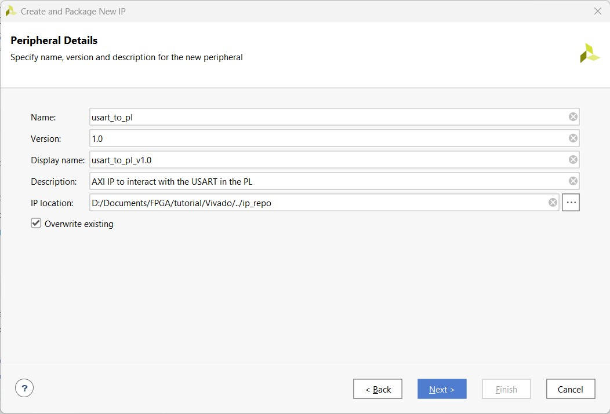

4. Leave the ports as default

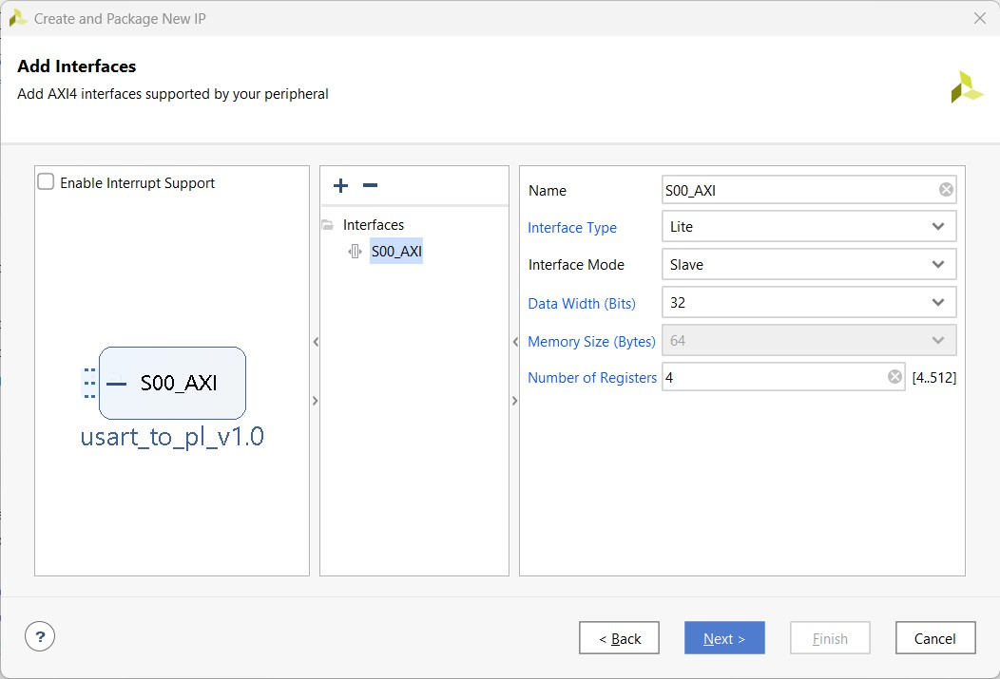

5. Select "Edit IP", then "Finish"

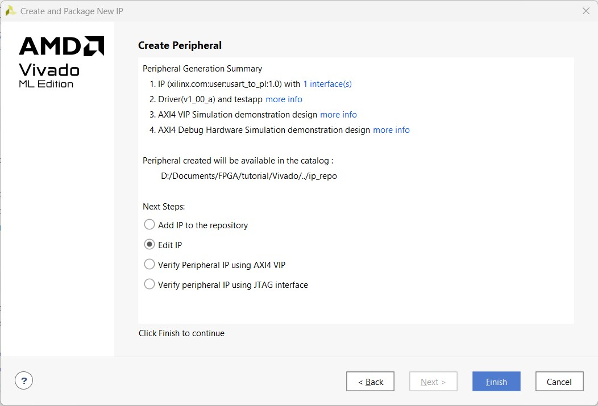

### Editing the custom IP

Once you've created the IP a new Vivado window will open. On Sources > Design Sources you'll find the `usart_to_pl` wrapper, and the instance.

#### Editing the custom IP instance

1. First we'll edit the `usart_to_pl` instance. Double click on `usart_to_pl_v_1_0_S00_AXI_inst`

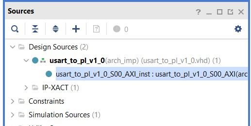

2. Add the following ports:

```vhdl
-- Users to add ports here
		
usart_print : in std_logic_vector(7 downto 0);
usart_print_valid : in std_logic;
usart_print_done : out std_logic;

usart_read : out std_logic_vector(7 downto 0);
usart_read_valid : out std_logic;
usart_read_request : in std_logic;
```

They will be used to request read and prints from the USART.

3. On the "user logic" section, link the out ports with the register 0 and 1:

```vhdl
-- Add user logic here

usart_read <= slv_reg0(7 downto 0);
usart_read_valid <= slv_reg0(8);
usart_print_done <= slv_reg1(0);
```

4. To send data, we'll need to modify the "Implement memory mapped register" section. Find it, and then change the sensitivity list and `loc_addr` `10` and `11` output:

```vhdl
-- Implement memory mapped register select and read logic generation
-- Slave register read enable is asserted when valid address is available
-- and the slave is ready to accept the read address.
slv_reg_rden <= axi_arready and S_AXI_ARVALID and (not axi_rvalid) ;

process (slv_reg0, slv_reg1, usart_print_valid, usart_print, usart_read_request, axi_araddr, S_AXI_ARESETN, slv_reg_rden)
variable loc_addr :std_logic_vector(OPT_MEM_ADDR_BITS downto 0);
begin
  -- Address decoding for reading registers
  loc_addr := axi_araddr(ADDR_LSB + OPT_MEM_ADDR_BITS downto ADDR_LSB);
  case loc_addr is
    when b"00" =>
      reg_data_out <= slv_reg0;
    when b"01" =>
      reg_data_out <= slv_reg1;
    when b"10" =>
      reg_data_out <= (C_S_AXI_DATA_WIDTH-1 downto 9 => '0') & usart_print_valid & usart_print; -- 8 LSB is the data, and the followed by the "is valid" bit. The rest is all 0
    when b"11" =>
      reg_data_out <= (C_S_AXI_DATA_WIDTH-1 downto 1 => '0') & usart_read_request;
    when others =>
      reg_data_out  <= (others => '0');
  end case;
end process; 
```

#### Editing the custom IP wrapper

5. Now open the wrapper (`usart_to_pl_v_1_0`)

6. Add the ports we've added earlier:

```vhdl
-- Users to add ports here

usart_print : in std_logic_vector(7 downto 0);
usart_print_valid : in std_logic;
usart_print_done : out std_logic;

usart_read : out std_logic_vector(7 downto 0);
usart_read_valid : out std_logic;
usart_read_request : in std_logic;
```

7. In the `usart_to_pl_v1_0_S00_AXI` port definition, you'll have to add the ports again:

```vhdl
architecture arch_imp of usart_to_pl_v1_0 is
-- component declaration
  component usart_to_pl_v1_0_S00_AXI is
    generic (
      C_S_AXI_DATA_WIDTH	: integer	:= 32;
      C_S_AXI_ADDR_WIDTH	: integer	:= 4
    );
    port (
      usart_print : in std_logic_vector(7 downto 0);
      usart_print_valid : in std_logic;
      usart_print_done : out std_logic;
      usart_read : out std_logic_vector(7 downto 0);
      usart_read_valid : out std_logic;
      usart_read_request : in std_logic;

      S_AXI_ACLK	: in std_logic;
      ...
```

8. On the part of the code the instance is made, connect the ports:

```vhdl
-- Instantiation of Axi Bus Interface S00_AXI
usart_to_pl_v1_0_S00_AXI_inst : usart_to_pl_v1_0_S00_AXI
  generic map (
    C_S_AXI_DATA_WIDTH	=> C_S00_AXI_DATA_WIDTH,
    C_S_AXI_ADDR_WIDTH	=> C_S00_AXI_ADDR_WIDTH
  )
  port map (
    usart_print => usart_print,
    usart_print_valid => usart_print_valid,
    usart_print_done => usart_print_done,
    usart_read => usart_read,
    usart_read_valid => usart_read_valid,
    usart_read_request => usart_read_request,

    S_AXI_ACLK	=> s00_axi_aclk,
    ...
```

#### Finishing the custom IP

9. On the "Package IP" tab, go to "Customization Parameters", then hit "Merge changes from Customization Parameters Wizard"

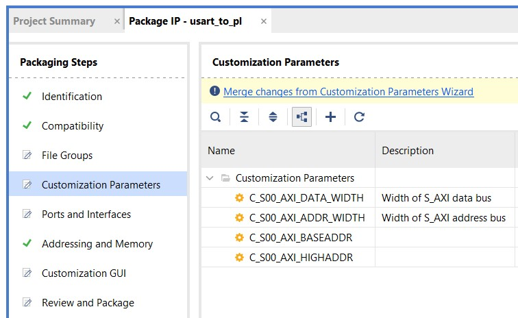

10. On "Compatibility", make sure "zynq" is there. Otherwise, hit the "+" button, "Add Family Explicitly...", and select "zynq". Life-cycles are irrelevant in this tutorial

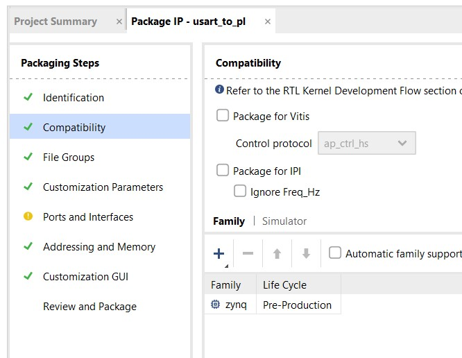

<details>
  <summary>Not there? Check: how to add a compatible board</summary>

  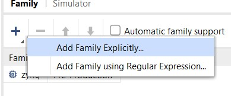

  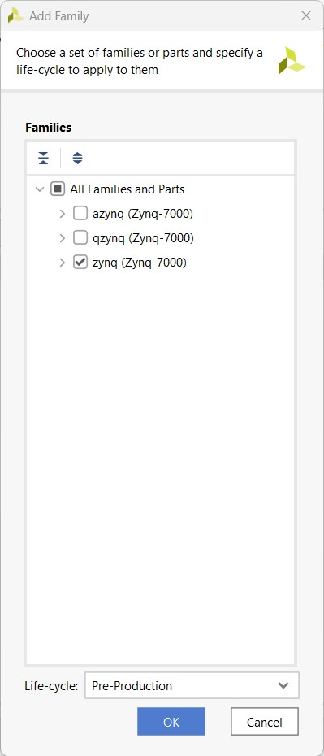
</details>

11. On Vivado version 2023.1 there's a bug with the generated Makefile on custom IPs (you can check for more information [here](https://support.xilinx.com/s/question/0D52E00006iHq5pSAC/board-images-not-set-and-xpfm-file-deleted-automatically?language=en_US)). To solve it you'll have to go to the IP path you've selected, go to `drivers/usart_to_pl_v1_0/src`, and change the Makefile from:

```
INCLUDEFILES=*.h
LIBSOURCES=*.c
OUTS = *.o
```

To:

```
INCLUDEFILES=$(wildcard *.h)
LIBSOURCES=$(wildcard *.c)
OUTS=$(wildcard *.o)
```

12. Go to "Review and Package", and hit "Re-Package IP"


13. Close the project

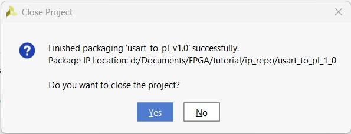

### Creating a Block Design

1. On the left, select "IP Integrator > Create Block Design"

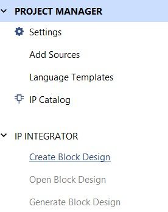

2. You can set a name if you want, I'll leave it as default

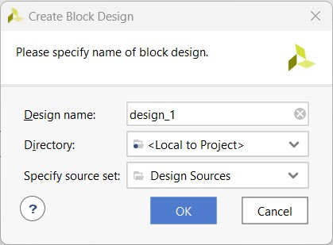

3. The design will open. Right click on it, "Add IP..."

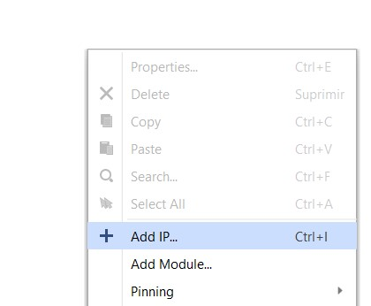

4. Search for "ZYNQ7 Processing System", and add it

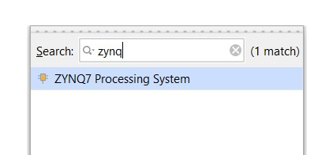

5. On the top, click "Run Block Automation". Leave it all as default, hit "OK"

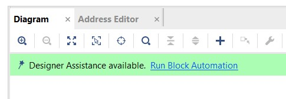

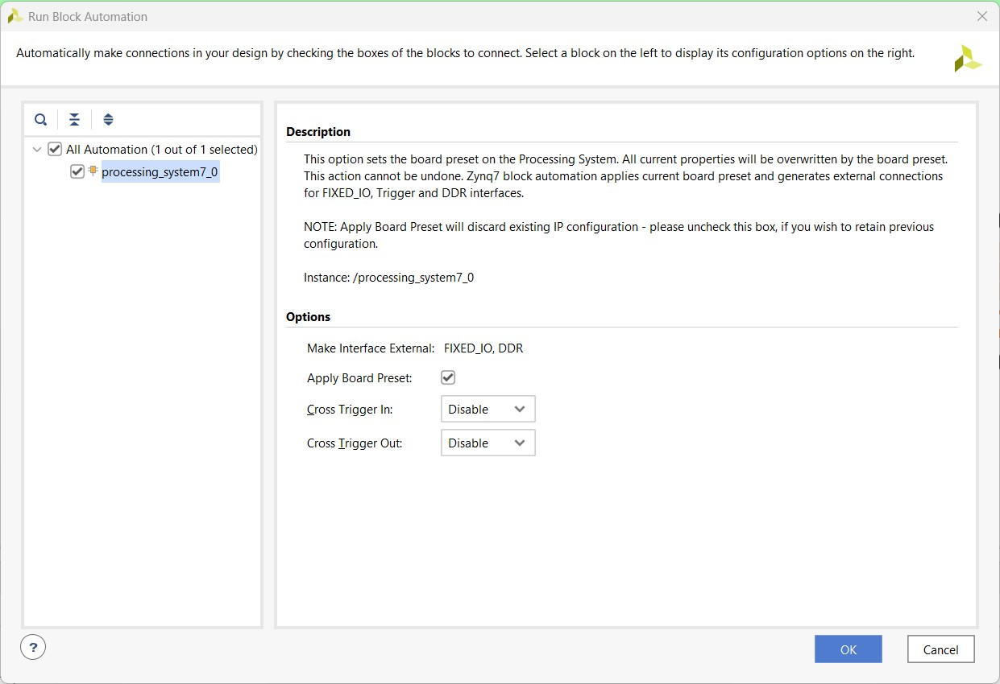

6. Again, right click, "Add IP...", and add the custom IP

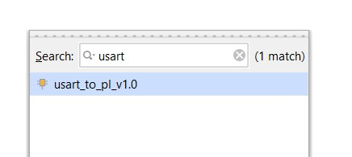

7. On the top, click "Run Connection Automation". Leave it all as default, hit "OK"

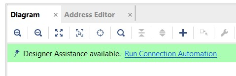

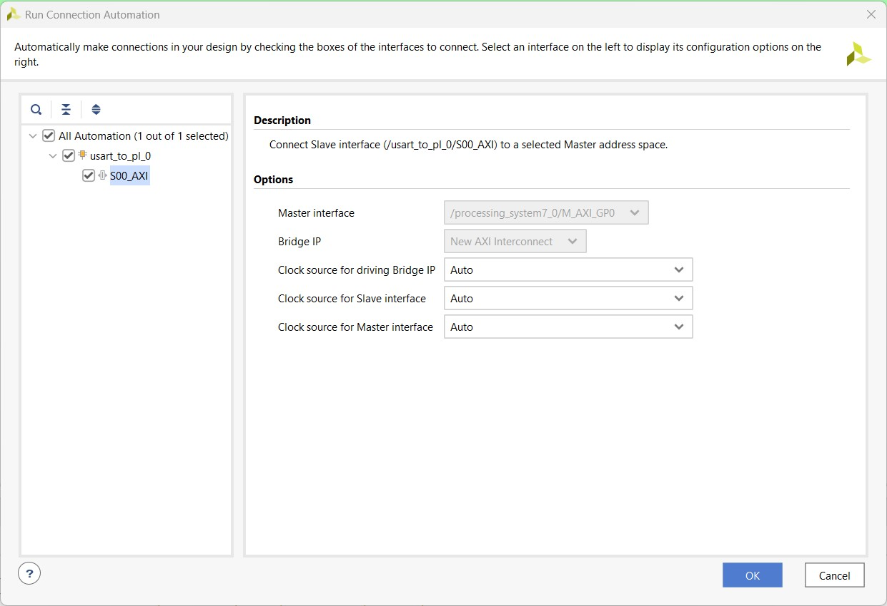

8. You should see something like this:

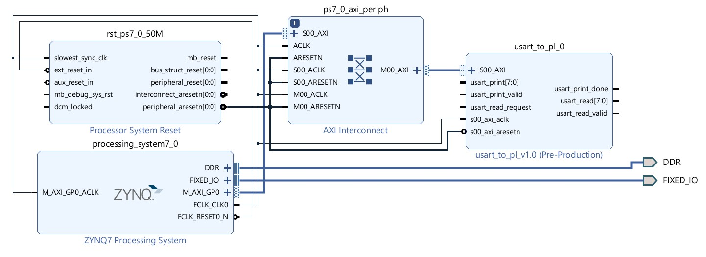

### Adding extra sources

To broadcast the data and send it to the LEDs we'll need 3 files:
- `ascii_to_number`: will take the ASCII data and convert it to a binary output
- XDC file: will tell Vivado how to connect the external ports to the Zybo board
- `usart_broadcaster`: will request the data, and then send it back and to `ascii_to_number`, respecting the timings defined by the custom IP (we'll talk about it later)

1. Right click on "Design Sources", then "Add Sources..."

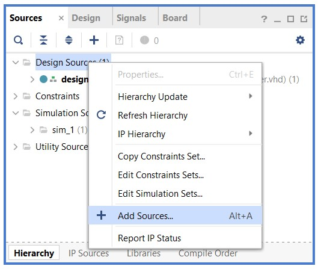

2. We'll add first two design sources

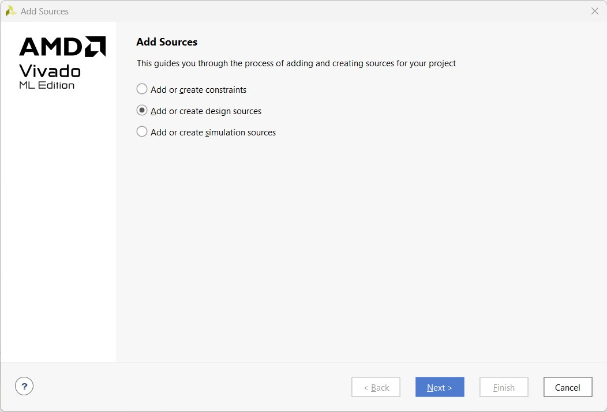

3. Hit "Create File", add an VHDL file `usart_broadcaster` and then `ascii_to_number`, and then hit "Finish"

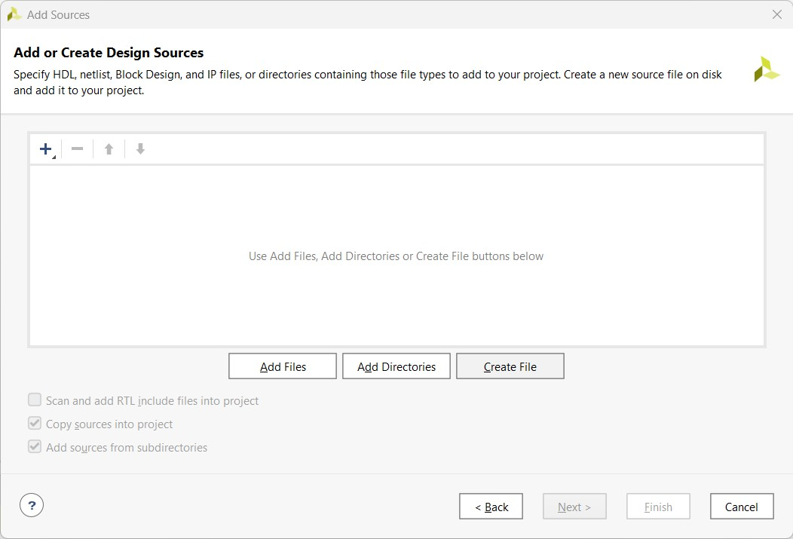

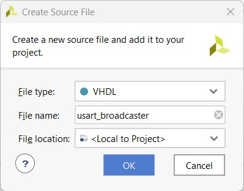

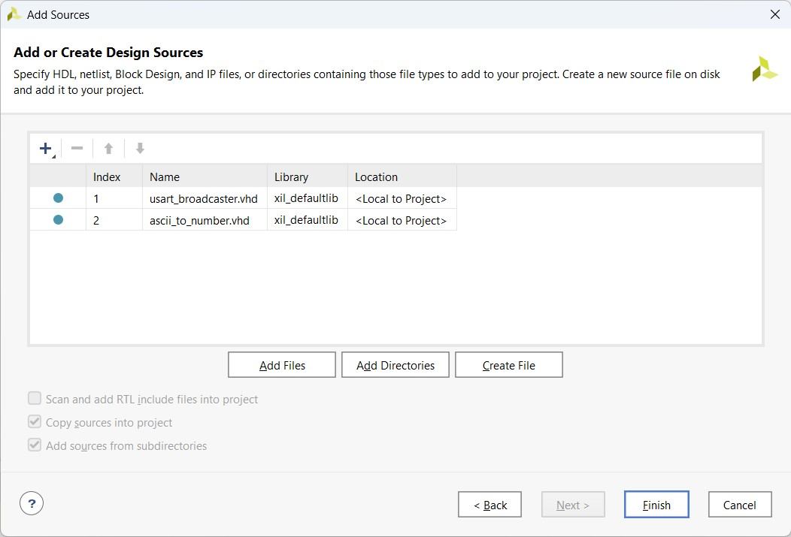

4. Leave everything as default, hit "OK"

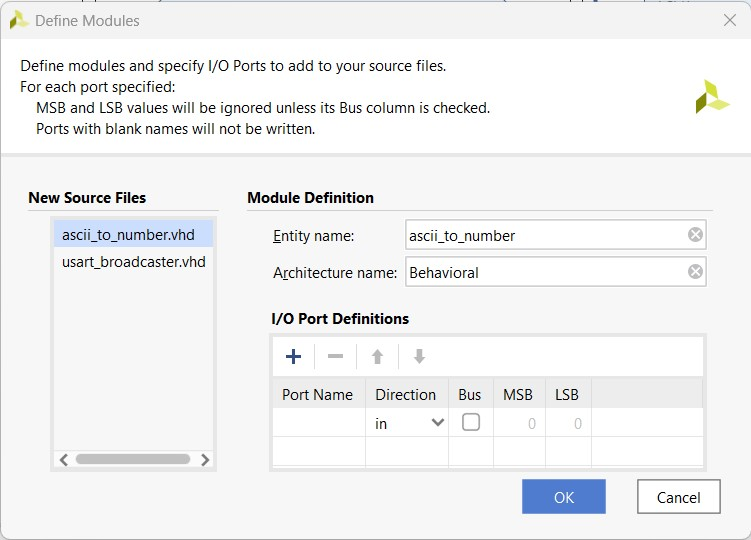

5. Open `ascii_to_number`, paste the following code:

```vhdl
library IEEE;
use ieee.std_logic_1164.all;
use ieee.numeric_std.all;

entity ascii_to_number is
  Port (
    value : in std_logic_vector(7 downto 0);
    value_valid : in std_logic;
    
    o : out std_logic_vector(3 downto 0)
  );
end ascii_to_number;

architecture Behavioral of ascii_to_number is
begin
    process(value,value_valid)
        variable result : unsigned(7 downto 0);
    begin
        if (value_valid = '1' and (value >= x"30" and value <= x"39")) then -- got a number?
            result := unsigned(value) - to_unsigned(48, 8); -- equivalent for ASCII character '0'; remember that 0 to 9 are consecutive ASCII elements
        end if;
        
        o <= std_logic_vector(result(3 downto 0));
    end process;
end Behavioral;
```

6. Open `usart_broadcaster`, paste the following code:

```vhdl
library IEEE;
use IEEE.STD_LOGIC_1164.ALL;

entity usart_broadcaster is
  Port (
    clock : in std_logic;
    resetn : in std_logic;

    usart_data : out std_logic_vector(7 downto 0);
    usart_data_valid : out std_logic;
    
		
    usart_print : out std_logic_vector(7 downto 0);
    usart_print_valid : out std_logic;
    usart_print_done : in std_logic;
    usart_read : in std_logic_vector(7 downto 0);
    usart_read_valid : in std_logic;
    usart_read_request : out std_logic
  );
end usart_broadcaster;

architecture behavioral of usart_broadcaster is
    type t_State is (DATA_REQUEST, DATA_SEND);
    signal state : t_State;
begin
    process(clock) is
    begin
        if rising_edge(clock) then
            if resetn = '0' then
                state <= DATA_REQUEST;
            else
                case state is
                    -- request a read
                    when DATA_REQUEST =>
                        usart_print_valid <= '0'; -- done printing
                        usart_data_valid <= '0'; -- out data invalid

                        usart_read_request <= '1';
                        
                        if (usart_read_valid = '1' and usart_print_done = '0') then
                            -- done reading and ready to print; prepare printing
                            usart_data <= usart_read;
                            usart_print <= usart_read;

                            state <= DATA_SEND;
                        end if;

                    -- print request
                    when DATA_SEND =>
                        usart_read_request <= '0'; -- done reading
                        usart_data_valid <= '1'; -- out data valid

                        -- data already loaded on the last state
                        usart_print_valid <= '1';
                        
                        if (usart_print_done = '1' and usart_read_valid = '0') then
                            -- done printing and ready to read
                            state <= DATA_REQUEST;
                        end if;
                end case;
            end if;
        end if;
    end process;
end behavioral;
```

The broadcaster has two states, one to request a data, and the other to print it (and forward it to the other PL blocks). That way we meet the following timing criteria:

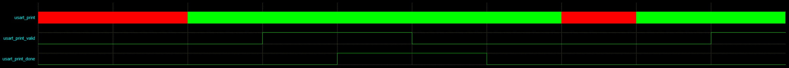


7. Drag&drop `usart_broadcaster`, then connect the ports with their respective ports on `usart_to_pl`. Connect `clock` to `s00_axi_aclk`, and `resetn` to `s00_axi_resetn`. For convenience, I've rotated the usart_to_pl block in the diagram

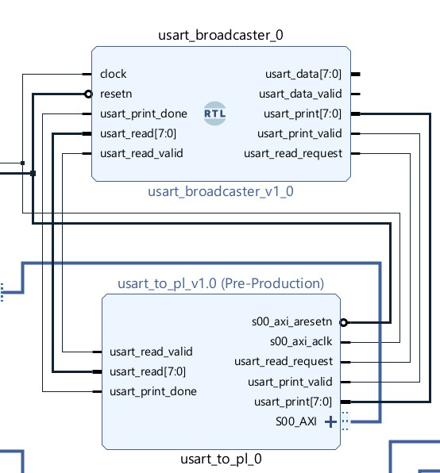

8. Drag&drop `ascii_to_number`, then connect the ports to the broadcaster

9. Right click on `ascii_to_number`'s out port, "Make External"


10. Set the external pin name to "led"

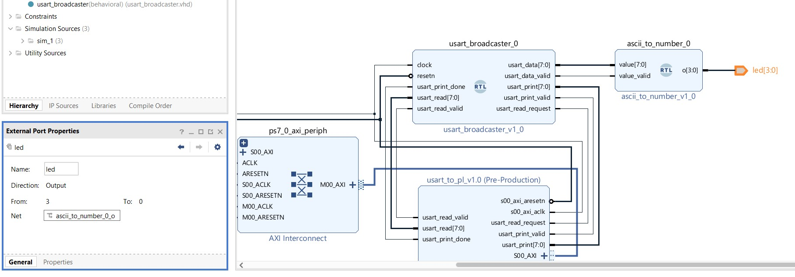

11. Now we'll add the XDC file. Right click on "Design Sources", "Add Sources...", and this time select "Add or create constraints"


12. Select "Add Files"

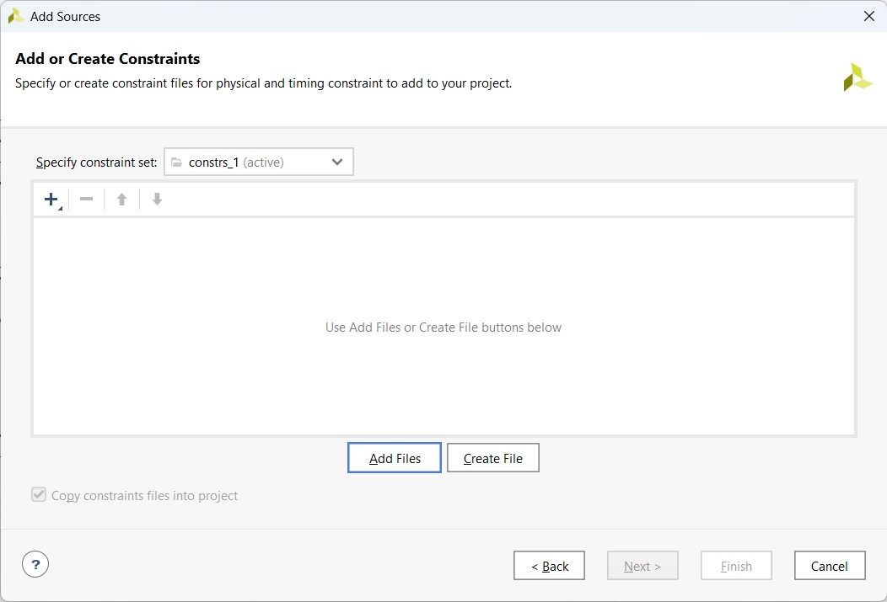

13. Search your board's XDC file (if you don't have it check how to get it on the [Requirements section](#requirements))

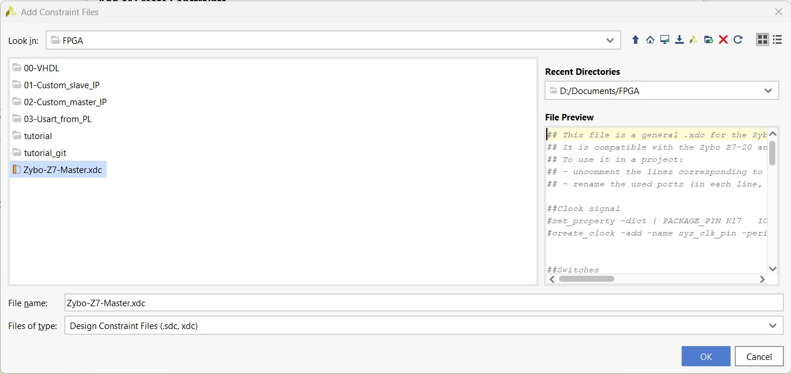

14. Make sure "Copy constraints file into project" is checked, then hit "Finish"


15. The file is under the Constraints folder, double click to open it

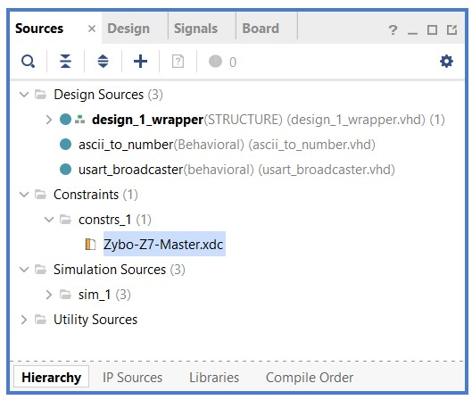

16. Uncomment the LEDs constraints:

```
##LEDs
set_property -dict { PACKAGE_PIN M14   IOSTANDARD LVCMOS33 } [get_ports { led[0] }]; #IO_L23P_T3_35 Sch=led[0]
set_property -dict { PACKAGE_PIN M15   IOSTANDARD LVCMOS33 } [get_ports { led[1] }]; #IO_L23N_T3_35 Sch=led[1]
set_property -dict { PACKAGE_PIN G14   IOSTANDARD LVCMOS33 } [get_ports { led[2] }]; #IO_0_35 Sch=led[2]
set_property -dict { PACKAGE_PIN D18   IOSTANDARD LVCMOS33 } [get_ports { led[3] }]; #IO_L3N_T0_DQS_AD1N_35 Sch=led[3]
```

### Exporting to Vitis

1. Right click on the created block design, "Create HDL Wrapper..."

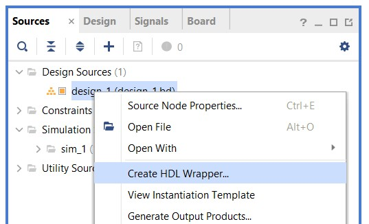

2. Select "Let Vivado manage wrapper and auto update", and hit "OK"

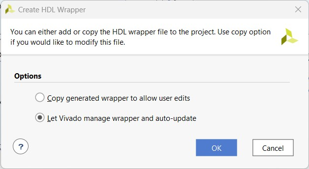

If you get a `Parameter has negative value` warning ignore it.

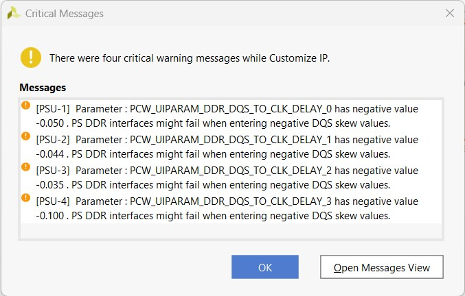

3. On the top, select "Generate Bitstream"


4. Launch as many jobs as you can, then hit "OK"

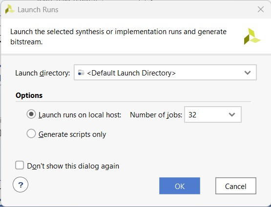

5. Wait for the bitstream generation (you'll see the loading process on the top right)

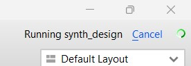

6. Once it's done a window will pop, hit "Cancel"

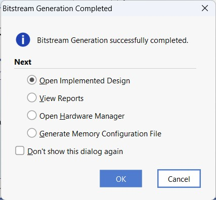

7. Select "File > Export > Export Hardware..."

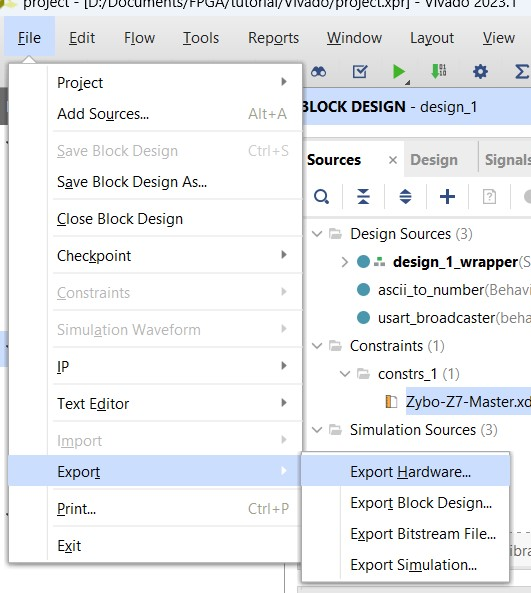

8. Click "Next"

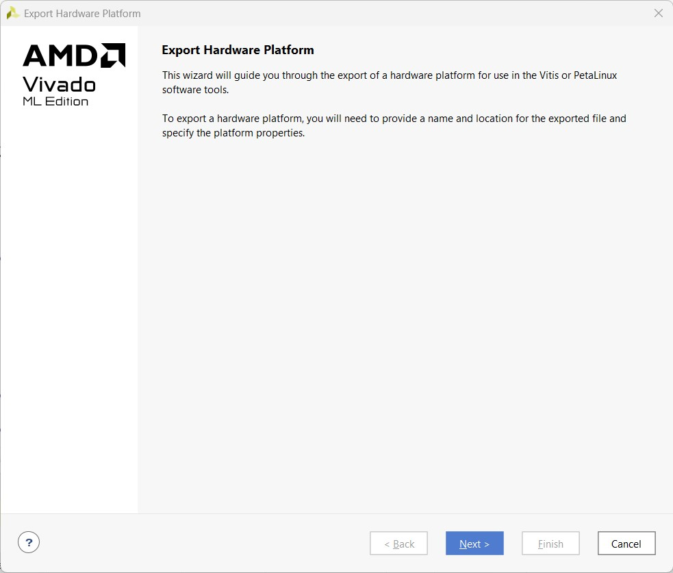

9. Make sure "Include bitstream" is selected, then hit "Next"

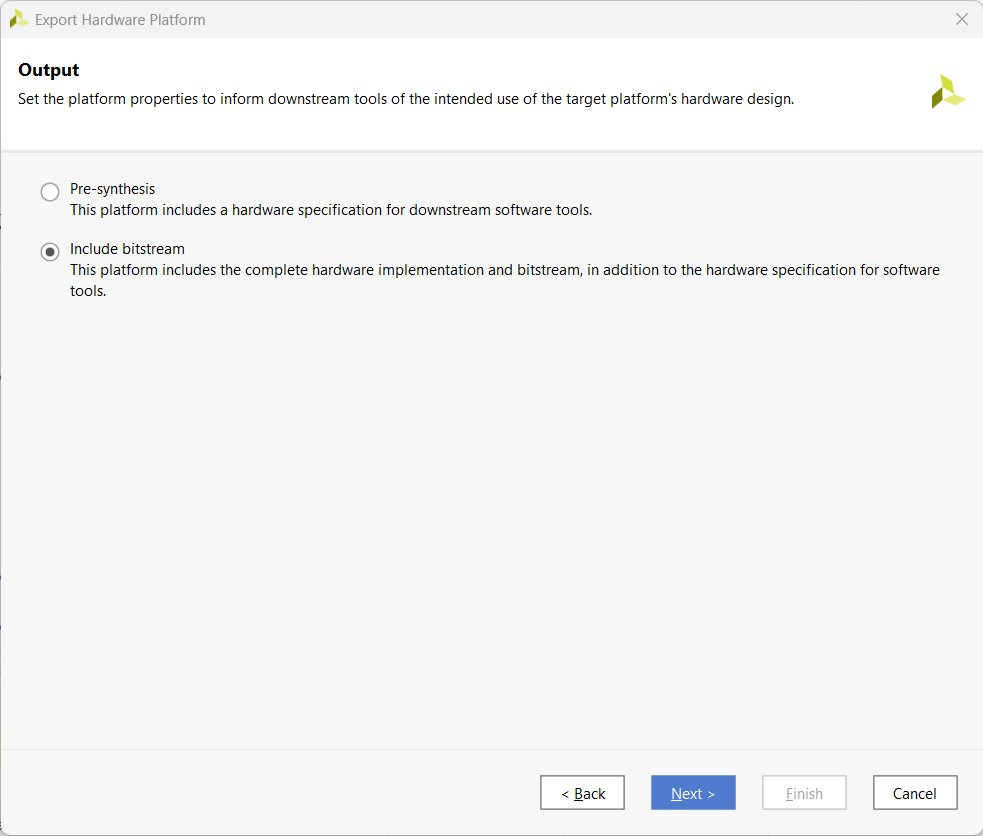

10. Click "Next", "Finish"


### Creating a Vitis project

1. Launch Vitis (you can use "Tools > Launch Vitis IDE")


2. Go to "File > New > Application Project..."


3. Hit "Next"


4. Go to "Create a new platform from hardware (XSA)", select "Browse..." and select the XSA you've exported on Vivado


5. Make sure "Generate boot components" is checked, then hit "Next"


6. Set `usart_from_pl` as "Application project name", then hit "Next"


7. Leave the domain as default, hit "Next"


8. Select "Empty Application (C)"


### Creating the Vitis main

1. Right click the `src` folder, "New > File"


2. Set `main.c` as name, hit "Finish"


3. Open `main.c` (double click) and paste the following code:

```c
#include <stdio.h>
#include "platform.h"
#include "xil_printf.h"
#include "xbasic_types.h"
#include "xparameters.h"
#include "xuartps_hw.h" // XUARTPS_FIFO_OFFSET

#define is_valid(data) ((data & (1<<8)) > 0)

Xuint8 unwaited_read(unsigned char *valid) {
	*valid = XUartPs_IsReceiveData(STDIN_BASEADDRESS);
	if (!(*valid)) return 0;

	return (Xuint8) XUartPs_ReadReg(STDIN_BASEADDRESS, XUARTPS_FIFO_OFFSET);
}

int main() {
	Xuint32 data;
	Xuint8 inp, valid;
	Xuint8 last_send_request = 0;
	Xuint8 send_request, print_request;
    volatile Xuint32 *slaveaddr_p = (Xuint32 *) XPAR_USART_TO_PL_0_S00_AXI_BASEADDR;

    xil_printf("\r\nWrite something:\r\n");

    while (1) {
    	send_request = (*(slaveaddr_p+3)) & 0x01;
		if (send_request > 0) {
	    	if (send_request != last_send_request) {
				// send chars from usart to PL
				inp=unwaited_read(&valid);
				if (valid) {
					data = (Xuint32)inp;
					data |= (1<<8); // mark as valid
					*slaveaddr_p = data; // send data

					last_send_request = send_request;
				}
	    	}
		}
		else {
			*slaveaddr_p = 0; // invalid
    		last_send_request = send_request;
		}

		// print data from PL to usart
		data = *(slaveaddr_p+2);
		print_request = is_valid(data);
		if (print_request) {
			xil_printf("%c", data&0xFFFF);
			*(slaveaddr_p+1) = 1; // print ok
		}
		else {
			*(slaveaddr_p+1) = 0; // done printing
		}
    }

    return 0;
}
```

4. Build the project (top left hammer icon)


### Uploading the code to the board

1. Connect your board to the computer

2. Right click `usart_from_pl`, then "Run As > Launch Hardware (Single Application Debug)"


### Interacting with the board

You'll need a serial terminal to interact with the code, in this section we'll use the one included in Vitis.

1. Go to "Window > Show view..."


2. Search for "Vitis Serial Terminal", then hit "Open"


3. Now you should have it on the bottom right corner. Click the plus (+) icon to connect to the board


4. Select the only port available, then hit "OK". Leave the Baud Rate as it is (115200)


5. Send a number, and see the LEDs change!


### Thanks for following!

Remember to give me a star if it was useful! I'm also open for PR for code improvements.

## References

- To create a project, refer to the ["Getting Started with Vivado and Vitis for Baremetal Software Projects" guide](https://digilent.com/reference/programmable-logic/guides/getting-started-with-ipi)
- All the boards XDC files are on the [Digilent XDC GitHub repo](https://github.com/Digilent/digilent-xdc)
- To create a slave AXI custom IP, refer to ["Creating a Custom IP core using the IP Integrator"](https://digilent.com/reference/learn/programmable-logic/tutorials/zybo-creating-custom-ip-cores/start)
- For the PS-PL exchange I used part of the code found on the ["Creating a Custom AXI4 Master in Vivado" tutorial](https://github.com/k0nze/zedboard_axi4_master_burst_example)
- The bug about the Makefile was discussed on the xilinx forum ["Board Images not set and .xpfm file deleted automatically"](https://support.xilinx.com/s/question/0D52E00006iHq5pSAC/board-images-not-set-and-xpfm-file-deleted-automatically)